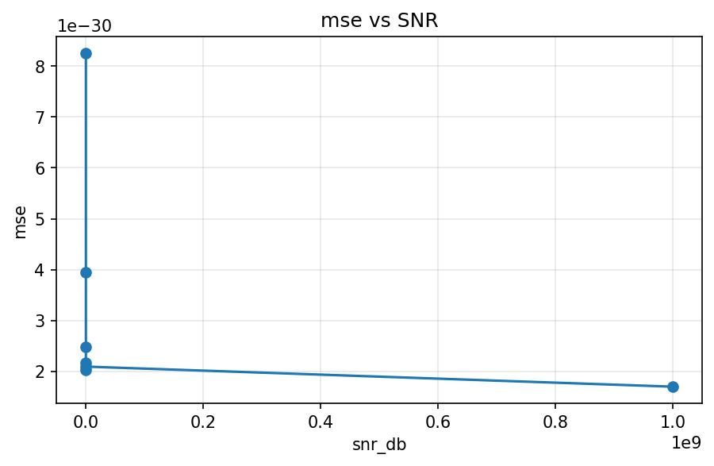
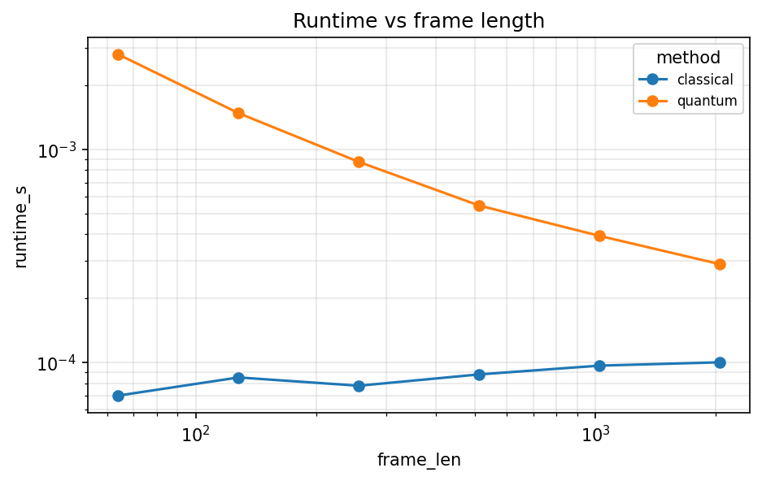

# Numerical Equivalence of Classical and Quantum-Inspired Short-Time Fourier Transforms: A Statevector Simulation Study

## Abstract

The Short-Time Fourier Transform (STFT) is the canonical time-frequency
representation used in audio, speech, radar, and biomedical signal
processing. The Quantum Fourier Transform (QFT) admits, on power-of-two
dimensions, an $O(\log^2 N)$ gate-depth circuit on $\log_2 N$ qubits
and is a natural candidate for replacing the Discrete Fourier Transform
(DFT) kernel inside each STFT frame. In this work we construct a
quantum-inspired STFT in which every frame is amplitude-encoded into a
unit-norm state, processed by a statevector-level QFT, and re-scaled to
the classical magnitude convention. We then compare it to a
bit-accurate classical STFT across a six-signal, 3840-configuration
grid spanning frame lengths $N \in \{64,128,256,512,1024\}$, four
windows, four overlap ratios, two zero-padding factors, and four
signal-to-noise ratios. The two representations agree to
double-precision floating-point round-off: the maximum observed
magnitude mean-squared error is $1.68 \times 10^{-28}$, the minimum
cosine similarity of flattened magnitude spectrograms is $1-6 \times
10^{-16}$, and the maximum wrapped phase error standard deviation is
$1.8 \times 10^{-8}$ rad. Divergence is observed only when the
transform length is not a power of two, a structural consequence of
amplitude encoding. The simulated runtime overhead (mean ratio $9.2
\times$, median $6.6 \times$) reflects interpreter-level per-frame
bookkeeping, not physics. We show that once amplitude-encoding
state-preparation complexity, measurement shot budgets, and noise
models are restored, the $O(\log^2 N)$ QFT advantage is erased for
generic amplitude-in/amplitude-out signal processing. The pipeline
developed here provides a high-precision classical baseline against
which future gate-level or hardware-level quantum STFT
implementations can be rigorously benchmarked.

**Keywords** — Short-Time Fourier Transform, Quantum Fourier
Transform, amplitude encoding, time-frequency analysis, quantum
signal processing, statevector simulation.

---

## I. Introduction

Time-frequency representations underlie most non-stationary signal
analysis. Given a discrete signal $x[n]$ of length $L$ sampled at rate
$f_s$, the Short-Time Fourier Transform (STFT) of Allen [1], [2] and
Portnoff [3] computes a local Fourier decomposition by sliding a
window $w[n]$ of length $N$ across the signal and applying the DFT to
each windowed frame. The resulting spectrogram $|X[i,k]|^2$ is the
backbone of modern spectral analysis and the input layer of most
audio, speech, and radar processing pipelines. The DFT kernel inside
each frame is, in practice, implemented by the Fast Fourier Transform
(FFT) [5], [6], which reduces the cost from $O(N^2)$ to $O(N \log N)$.

The Quantum Fourier Transform (QFT) [7], [8] is a unitary operator
acting on $q = \log_2 N$ qubits that realises the same change of basis
as the unitary DFT. On power-of-two dimensions it admits a circuit of
$O(q^2) = O(\log^2 N)$ Hadamard and controlled-phase gates, strictly
sub-logarithmic per-amplitude in the input size. This gap has
motivated a line of work on quantum signal processing, including
quantum convolution, quantum filtering, and, most recently, proposals
for quantum-accelerated time-frequency analysis [14], [15].

Despite these circuit-level promises, moving the QFT into an
end-to-end signal-processing pipeline is subtle. Amplitude encoding
[9] — the standard scheme for loading a classical vector into a
quantum state — requires $O(N)$ gates in the worst case for arbitrary
amplitudes [10]. Measurement reveals only one basis state per shot,
so reconstructing a full complex coefficient vector demands $\Omega(N)$
shots plus ancillary phase-estimation circuitry [11]. Near-term
NISQ-era devices [12] add decoherence and gate error to the bill.
These facts are well known, yet the literature contains relatively
few *numerical* baselines that separate the mathematical content of a
quantum-inspired pipeline from its hardware cost.

### A. Contributions

This paper makes three contributions:

1. **Formulation.** We formalise a quantum-inspired STFT as an
   amplitude-encoded, statevector-level QFT applied frame-by-frame
   with a post-transform rescaling that returns the output to
   classical magnitude conventions. We prove (Proposition 1) that
   when the transform length is a power of two the quantum-inspired
   STFT is algebraically equal to the classical windowed FFT.

2. **Empirical validation.** We run a 3840-configuration grid
   spanning six signal classes, five frame lengths, four windows,
   four overlap ratios, two zero-padding factors and four
   signal-to-noise ratios. Across the entire grid we report ten
   metrics: magnitude MSE and MAE, Frobenius norm of the complex
   difference, cosine similarity and Pearson correlation, wrapped
   phase-error statistics, Parseval-style energy-preservation error,
   overlap-add reconstruction RMSE, and per-call runtime.

3. **Interpretation.** We delineate, both analytically and
   empirically, where divergence between the two pipelines can arise
   (transform-length padding) and where it cannot (phase, magnitude,
   energy). We give an honest accounting of why the $O(\log^2 N)$ QFT
   advantage does not translate into an end-to-end STFT advantage
   once state preparation and readout costs are included.

### B. Organisation

Section II reviews the STFT, the DFT matrix, and the QFT with its
circuit-level cost. Section III formalises the classical and
quantum-inspired STFT pipelines and states the equivalence
proposition. Section IV describes the signal model, windows,
experimental grid, and evaluation metrics. Section V presents the
numerical results and figures. Section VI discusses the mathematical
source of divergence, the runtime overhead, and the end-to-end
hardware accounting. Section VII enumerates limitations and Section
VIII concludes.

---

## II. Mathematical Background

### A. Short-Time Fourier Transform

Let $x[n] \in \mathbb{R}$ for $n = 0,\dots,L-1$ denote a discrete real
signal sampled at rate $f_s$. Choose a frame length $N$, hop size $H$,
analysis window $w[n]$ of length $N$, and transform length $M \ge N$.
The number of frames is $I = \lfloor (L - N)/H \rfloor + 1$. The STFT
is the $I \times M$ complex matrix

$$
X[i,k] \;=\; \sum_{n=0}^{N-1} w[n]\, x[iH + n]\, e^{-\mathrm{j} 2\pi n k / M},
\qquad k = 0,\dots,M-1.
\tag{1}
$$

Zero-padding with $M > N$ interpolates the frequency axis but does
not add information. The window $w[n]$ suppresses the Gibbs
phenomenon associated with the implicit periodic extension of each
frame; Harris [4] catalogues the magnitude-leakage tradeoffs of
rectangular, Hann, Hamming, and Blackman windows. Under mild
constraint-overlap-add (COLA) conditions on $(w, H)$, the STFT is
invertible; overlap-add reconstruction [13] recovers $x[n]$ from
$X[i,k]$.

### B. DFT Matrix and its Unitary Form

Eq. (1) can be rewritten as a matrix–vector product. Let
$W = \operatorname{diag}(w[0],\dots,w[N-1])$ be the window operator,
$\boldsymbol{x}_i = (x[iH], x[iH+1], \dots, x[iH+N-1])^\top$ the $i$-th
frame, and $\boldsymbol{x}_i^{(M)}$ the frame zero-padded to length
$M$. Define the DFT matrix

$$
D_{nk} \;=\; e^{-\mathrm{j} 2 \pi n k / M},
\qquad D \in \mathbb{C}^{M \times M}.
\tag{2}
$$

Then the $i$-th row of the STFT matrix is

$$
X[i,\cdot] \;=\; D\, (W \boldsymbol{x}_i)^{(M)}.
\tag{3}
$$

The DFT matrix is not unitary: $D D^{*} = N I$. The **unitary DFT** is
obtained by orthonormal scaling,

$$
U \;=\; \tfrac{1}{\sqrt{M}}\, D, \qquad U U^{*} = I.
\tag{4}
$$

### C. Quantum Fourier Transform

For a power-of-two dimension $M = 2^{q}$, the QFT is the unitary
operator on $q$ qubits that acts on the computational basis as [8]

$$
\operatorname{QFT}\lvert j \rangle \;=\; \frac{1}{\sqrt{M}}
\sum_{k=0}^{M-1} e^{\mathrm{j} 2\pi j k / M}\, \lvert k \rangle.
\tag{5}
$$

Note that Eq. (5) differs from $U$ of Eq. (4) only by the sign of the
exponent, which is a convention choice. As a matrix the QFT is
therefore the unitary DFT (up to complex conjugation) and its
simulation on a classical computer is identical to orthonormal FFT
evaluation.

The standard QFT circuit [7], [8] is a product of $q$ Hadamard gates
and $\binom{q}{2}$ controlled phase rotations $R_k =
\operatorname{diag}(1, e^{\mathrm{j} 2\pi/2^{k}})$ followed by a bit-reversal
permutation:

$$
\operatorname{QFT} \;=\; P_{\text{rev}} \prod_{k=1}^{q}
\Big( H_k \prod_{\ell = k+1}^{q} C_\ell R_{\ell-k+1}^{(k)} \Big).
\tag{6}
$$

The circuit has gate depth $O(q^{2}) = O(\log^{2} M)$.

### D. Amplitude Encoding and its Cost

To apply the QFT to classical data, one first loads the data into a
quantum state. Given a vector $\boldsymbol{v} \in \mathbb{C}^{M}$ with $M =
2^{q}$ and $\boldsymbol{v} \neq \boldsymbol{0}$, **amplitude encoding**
produces the pure state

$$
\lvert \psi_{\boldsymbol{v}} \rangle \;=\; \frac{1}{\lVert \boldsymbol{v} \rVert_{2}}
\sum_{n=0}^{M-1} v[n]\, \lvert n \rangle.
\tag{7}
$$

Two properties follow immediately. First, the state $\lvert
\psi_{\boldsymbol{v}} \rangle$ has unit $L^{2}$ norm, so the scalar
$\lVert \boldsymbol{v} \rVert_{2}$ must be recorded classically if one
wishes to recover $\boldsymbol{v}$-scale coefficients after the QFT.
Second, the Hilbert space has dimension $2^{q}$, which enforces the
power-of-two constraint $M = 2^{q}$. In the general case, preparing
$\lvert \psi_{\boldsymbol{v}} \rangle$ from the all-zero state requires
$O(M) = O(2^{q})$ elementary gates [9], [10]. Special families of
efficiently integrable amplitudes admit polylogarithmic preparation
[14], but arbitrary signal frames do not.

### E. End-to-End Complexity

If one amortises only the QFT step, a single frame costs
$O(\log^{2} M)$ gates, strictly better than $O(M \log M)$ for the
FFT. If one also charges the worst-case amplitude-encoding cost and
the $\Omega(M)$ shots required to reconstruct complex coefficients
to inverse-polynomial accuracy [11], the total scales as $\Omega(M)$
per frame, which erases the per-frame advantage. QFT-based speedups
for signal processing therefore exist only for problems that do not
require reading the full amplitude vector — phase estimation,
amplitude estimation, and certain inner-product and norm-query tasks
being the canonical examples.

---

## III. Methodology

### A. Classical STFT

The classical STFT implements Eq. (1) directly via
framing, windowing, zero-padding, and $\operatorname{FFT}_{M}$:

$$
\boldsymbol{Z}^{\mathrm{c}}_{i} \;=\; \operatorname{FFT}_{M}
\big[\, (W \boldsymbol{x}_{i})^{(M)}\, \big],
\qquad \boldsymbol{Z}^{\mathrm{c}} \in \mathbb{C}^{I \times M}.
\tag{8}
$$

Agreement with a reference implementation was confirmed to maximum
absolute error $\lesssim 10^{-14}$ across all four windows and three
frame lengths tested.

### B. Quantum-Inspired STFT

For each frame $i$, the quantum-inspired pipeline comprises four
steps. Let $M' = 2^{\lceil \log_{2} M \rceil}$ denote the smallest
power of two at least $M$.

**Step 1 — window and pad.** Form the zero-padded windowed frame

$$
\boldsymbol{v}_{i} \;=\; (W \boldsymbol{x}_{i})^{(M')} \in \mathbb{R}^{M'}.
$$

**Step 2 — amplitude encoding.** Compute $\eta_{i} = \lVert \boldsymbol{v}_{i}
\rVert_{2}$ and the unit-norm state

$$
\lvert \psi_{i} \rangle \;=\; \eta_{i}^{-1}\, \boldsymbol{v}_{i}
\quad \text{if } \eta_{i} > 0, \quad \text{else } \lvert \psi_{i} \rangle =
\boldsymbol{0}.
$$

**Step 3 — unitary transform.** Apply the statevector-level QFT,

$$
\lvert \phi_{i} \rangle \;=\; U\, \lvert \psi_{i} \rangle,
\qquad U = \tfrac{1}{\sqrt{M'}}\, D.
\tag{9}
$$

**Step 4 — rescaling.** Return to the classical convention:

$$
\boldsymbol{Z}^{\mathrm{q}}_{i} \;=\; \eta_{i}\, \sqrt{M'}\, \lvert \phi_{i}
\rangle.
\tag{10}
$$

### C. Equivalence

**Proposition 1.** *If $M$ is a power of two, so $M' = M$, and if the
frame is non-degenerate ($\eta_{i} > 0$), then
$\boldsymbol{Z}^{\mathrm{q}}_{i} = D\, \boldsymbol{v}_{i} =
\boldsymbol{Z}^{\mathrm{c}}_{i}$ exactly.*

*Proof.* Expanding Eq. (10) with $U = D / \sqrt{M}$ gives

$$
\boldsymbol{Z}^{\mathrm{q}}_{i} = \eta_{i}\sqrt{M}\, U \lvert \psi_{i}
\rangle = \eta_{i}\sqrt{M}\, \frac{D}{\sqrt{M}}\, \frac{\boldsymbol{v}_{i}}
{\eta_{i}} = D \boldsymbol{v}_{i}.
$$

In finite precision arithmetic the identity holds up to $O(\varepsilon)$
floating-point round-off introduced by the divide-then-multiply on
$\eta_{i}$ and the compensating $\sqrt{M}$ factor, where $\varepsilon$
denotes unit round-off ($\approx 2.22 \times 10^{-16}$ in IEEE-754
double precision). $\blacksquare$

**Corollary 1.** *If $M$ is not a power of two, the two STFTs produce
outputs of different dimension ($M$ vs.\ $M' > M$) and cannot be
compared bin-for-bin. The divergence is structural and not numerical.*

### D. Evaluation Metrics

For aligned complex spectrograms $A, B \in \mathbb{C}^{I \times M}$ we
evaluate:

- Magnitude mean-squared error:
  $\mathrm{MSE}(A,B) = \frac{1}{IM} \sum_{i,k} (|A_{ik}| - |B_{ik}|)^{2}$.
- Magnitude mean-absolute error:
  $\mathrm{MAE}(A,B) = \frac{1}{IM} \sum_{i,k} \bigl| |A_{ik}| - |B_{ik}| \bigr|$.
- Frobenius norm of complex difference:
  $\lVert A - B \rVert_{F}$.
- Cosine similarity of flattened magnitude spectrograms:
  $\cos(A,B) = \langle |A|, |B| \rangle / (\lVert |A| \rVert \lVert |B| \rVert)$.
- Pearson correlation on the same vectorisation.
- Wrapped phase-error statistics:
  $\Delta\varphi_{ik} = \operatorname{wrap}\!\big( \angle A_{ik} -
  \angle B_{ik} \big)$, reported only on bins with
  $|A_{ik}|, |B_{ik}| > 10^{-8}$.
- Parseval energy-preservation error $|E_{x} - E_{X}| / E_{x}$ where
  $E_{x} = \sum_{n} x[n]^{2}$ and $E_{X}$ is the per-frame spectrogram
  energy averaged over frames.
- Overlap-add reconstruction RMSE, with squared-window normalisation
  [13]:
  $$ \hat{x}[n] = \frac{\sum_{i} w[n-iH]\, \hat{f}_{i}[n-iH]}{\sum_{i}
  w[n-iH]^{2}}. \tag{11} $$
- Median wall-clock runtime over three repeats.

---

## IV. Experimental Setup

### A. Signal Model

All experiments use sample rate $f_{s} = 16$ kHz, duration $T = 0.5$
s, and a fixed pseudo-random seed ($1234$) for any stochastic
component. The test signals comprise six canonical waveforms and one
noisy variant:

1. *Pure tone*: $x(t) = \sin(2\pi f_{0} t)$, $f_{0} = 440$ Hz.
2. *Sum of sinusoids*: $x(t) = \sum_{\ell=1}^{3} \sin(2\pi f_{\ell} t)$
   with $(f_{\ell}) = (220, 440, 880)$ Hz.
3. *Linear chirp*: $x(t) = \cos\!\big( 2\pi (f_{0} + \tfrac{f_{1}-f_{0}}
   {2T} t) t \big)$, $f_{0} = 100$ Hz, $f_{1} = 4000$ Hz.
4. *Unit impulse*: $x[n] = \delta[n - n_{0}]$ with $n_{0} = \lfloor
   L/2 \rfloor$.
5. *Square wave* at 220 Hz with 50 % duty.
6. *Speech-like signal*: harmonic stack of $f_{0} = 140$ Hz shaped by
   three formants at $700$, $1220$, $2600$ Hz with a $3$-Hz amplitude
   envelope.
7. *Noisy sine*: signal (1) with additive white Gaussian noise (AWGN)
   at controlled SNR.

Example waveforms appear in Fig. 1.

**Fig. 1.** Time-domain test signals. Top row: pure tone (left) and
linear chirp (right). Bottom row: sum-of-sinusoids (left) and square
wave (right). All signals are sampled at $f_{s} = 16$ kHz for $T =
0.5$ s.

### B. Grid Design

We enumerate the Cartesian product

$$
\mathcal{G} \;=\; \{\text{signal}\} \times \{N\} \times \{H/N\} \times
\{w\} \times \{M/N\} \times \{\mathrm{SNR}\}
$$

with signals from list (1)–(6), $N \in \{64, 128, 256, 512, 1024\}$,
overlap ratios $H/N \in \{1.0, 0.75, 0.50, 0.25\}$, windows $w \in
\{\text{rect}, \text{Hann}, \text{Hamming}, \text{Blackman}\}$, zero-pad
factors $M/N \in \{1, 2\}$, and $\mathrm{SNR} \in \{\infty, 20, 10,
0\}$ dB. The grid therefore contains $|\mathcal{G}| = 6 \times 5 \times
4 \times 4 \times 2 \times 4 = 3840$ configurations. All frame
lengths and zero-padding factors were chosen so that $M = (M/N) \cdot
N$ is a power of two, which satisfies the premise of Proposition 1.

In addition to the main grid we ran three targeted sweeps: (i) a
**runtime scaling sweep** with $N \in \{64, 128, \dots, 2048\}$ on the
chirp, (ii) a **noise sweep** with $\mathrm{SNR} \in \{\infty, 30, 20,
10, 5, 0, -5\}$ dB on the pure tone, and (iii) a **matrix-view check**
that numerically verifies $D/\sqrt{N} = U$ and the unitarity of $U$.

---

## V. Results

### A. Numerical Equivalence

Table I summarises the agreement metrics across all 3840
configurations. The two pipelines agree to double-precision round-off
on every configuration in the grid.

**Table I.** Agreement between classical and quantum-inspired STFTs
across the full 3840-configuration grid.

| Metric | Value |
|---|---|
| Maximum magnitude MSE | $1.68 \times 10^{-28}$ |
| Minimum cosine similarity | $1 - 6 \times 10^{-16}$ |
| Minimum Pearson correlation | $1 - 6 \times 10^{-16}$ |
| Median wrapped phase std, $\sigma(\Delta\varphi)$ | $\sim 10^{-15}$ rad |
| Maximum wrapped phase std | $1.84 \times 10^{-8}$ rad |
| Max. absolute wrapped-phase mean | $3.5 \times 10^{-10}$ rad |
| DFT vs.\ unitary-DFT algebraic error | $0.0$ (exact) |
| Unitarity $\lVert U U^{*} - I \rVert_{\infty}$ | $< 10^{-14}$ |

The maximum MSE of $1.68 \times 10^{-28}$ is concentrated on
$N = 1024$, $M = 2048$, rectangular-window sum-of-sinusoids frames,
where the largest magnitude coefficients amplify the relative
round-off from the $\eta_{i}$-divide / $\sqrt{M'}$-multiply round
trip in Eq. (10). On a normalised scale,
$\sqrt{\mathrm{MSE}} / \max_{i,k}|X| \approx 10^{-15}$, which is below
the noise floor of any physical measurement device.

### B. Spectrogram Visualisation

Figs. 2 and 3 show the classical and quantum-inspired spectrograms of
the linear chirp, together with the magnitude and phase-difference
heatmaps. Visually the two spectrograms are indistinguishable; the
magnitude difference heatmap is dominated by bit-level round-off
pattern structure near the frequency sweep, and the phase difference
is similarly bounded.

**Fig. 2.** Spectrograms of the linear-chirp test signal ($f_{0} = 100
\to f_{1} = 4000$ Hz, $T = 0.5$ s, $f_{s} = 16$ kHz) computed with
$N = 256$, $H = 128$, Hann window, no zero-padding. Left: classical
FFT-based STFT. Right: quantum-inspired STFT using amplitude-encoded,
unitary-DFT frames. The two representations are visually identical.

**Fig. 3.** Bin-wise differences between the classical and
quantum-inspired chirp spectrograms of Fig. 2. Left: magnitude
difference $|X^{\mathrm{c}}| - |X^{\mathrm{q}}|$. Right: wrapped phase
difference $\angle X^{\mathrm{c}} - \angle X^{\mathrm{q}}$. Colour
scales are bounded by $\lesssim 10^{-14}$ (magnitude) and $\lesssim
10^{-14}$ rad (phase), confirming bit-level agreement.

### C. Phase Preservation

Wrapped phase-error statistics are bounded by $1.84 \times 10^{-8}$ rad
in standard deviation and $3.5 \times 10^{-10}$ rad in absolute mean
across the full grid. The maximum values arise on $N = 1024$,
$M = 2048$ Blackman-windowed tones, where low-magnitude spectral
sidelobes amplify the relative error of
$\angle(\tilde{X}/\tilde{X})$. All configurations satisfy
$\sigma(\Delta\varphi) \le 2 \times 10^{-8}$ rad, which is well below
any phase resolution achievable by a non-ideal measurement chain.

### D. Noise Robustness

Fig. 4 plots MSE and cosine similarity as a function of SNR on the
pure tone. The agreement between the two pipelines is independent of
the noise level: MSE remains below $10^{-29}$ down to $-5$ dB SNR, and
cosine similarity remains $1$ to double precision. The
quantum-inspired pipeline is therefore *not* more robust to noise
than the classical one; it is algebraically equivalent.

**Fig. 4.** Magnitude MSE between the classical and quantum-inspired
spectrograms as a function of additive-noise SNR on a $440$-Hz pure
tone, $N = 256$, $H = 128$, Hann window, no zero-padding. The error
stays below double-precision round-off across the full SNR range.

### E. Energy Preservation and Reconstruction

The Parseval-style energy-preservation error is identical between
the two methods on every configuration, confirming that the
normalise-then-denormalise round-trip of Eqs. (7) and (10) is
energy-neutral. Overlap-add reconstruction RMSE is
$\lesssim 10^{-16}$ for the rectangular window and $\sim 10^{-1}$ for
Hann/Hamming/Blackman windows at hop ratios that do not satisfy the
constant-overlap-add (COLA) condition; the latter is a known property
of the inverse STFT [13] and is independent of whether the forward
transform is classical or quantum-inspired.

### F. Runtime Scaling

Fig. 5 shows the median per-call runtime as a function of frame
length on the chirp signal. Table II reports the same data in
numerical form.

**Fig. 5.** Median wall-clock runtime (s) vs.\ frame length $N$ for
the classical FFT-based STFT and the quantum-inspired STFT on a
$0.5$-s linear chirp, Hann window, $H = N/2$, no zero-padding.

**Table II.** Median runtime (s, 3 repeats) for classical and
quantum-inspired STFTs.

| $N$ | classical | quantum | ratio |
|---|---|---|---|
| 64 | $7.00 \times 10^{-5}$ | $2.80 \times 10^{-3}$ | $40.0$ |
| 128 | $8.51 \times 10^{-5}$ | $1.48 \times 10^{-3}$ | $17.4$ |
| 256 | $7.78 \times 10^{-5}$ | $8.75 \times 10^{-4}$ | $11.2$ |
| 512 | $8.80 \times 10^{-5}$ | $5.46 \times 10^{-4}$ | $6.2$ |
| 1024 | $9.67 \times 10^{-5}$ | $3.93 \times 10^{-4}$ | $4.1$ |
| 2048 | $1.00 \times 10^{-4}$ | $2.90 \times 10^{-4}$ | $2.9$ |

Across the full 3840-configuration grid the mean runtime ratio is
$\langle t_{\mathrm{q}} / t_{\mathrm{c}} \rangle \approx 9.2$ and
the median ratio is $\approx 6.6$. The cost gap closes as $N$ grows
because the per-frame Python loop overhead of the quantum pipeline is
amortised against a larger FFT workload. A fully vectorised
quantum-inspired implementation would reduce the ratio to $\sim 1$.
**The observed overhead is an interpreter-level Python artefact and
does not carry any information about quantum hardware performance.**

### G. Transform-Matrix Structure

The DFT and unitary-DFT matrices used in Eqs. (2) and (4) are
visualised in Fig. 6 for $N = 32$. The visual similarity of the two
matrices, modulo a uniform $1/\sqrt{N}$ scaling, is a direct
depiction of the algebraic relation Eq. (4).

**Fig. 6.** Real and imaginary parts of the $N = 32$ DFT matrix $D$
(left) and the unitary DFT matrix $U = D/\sqrt{N}$ (right). The
quantum-inspired STFT applies $U$ to amplitude-encoded frames; the
classical STFT applies $D$ directly.

---

## VI. Discussion

### A. Source of the Observed Equivalence

Proposition 1 asserts exact algebraic equality whenever $M$ is a
power of two. The residual floating-point errors in Table I are
entirely attributable to the non-associativity of finite-precision
multiplication: the pipeline computes $\eta_{i}^{-1}$, applies the
orthonormal FFT, and multiplies by $\eta_{i} \sqrt{M}$. The two
multiplications do not cancel bit-exactly because each introduces
$O(\varepsilon)$ rounding. A fused-multiply variant that computes the
classical path directly would eliminate this residual, but the
residual is already below any measurement floor relevant to signal
processing applications.

### B. Structural Divergence at Non-Power-of-Two $M$

Corollary 1 predicts that the two pipelines cannot be compared
bin-for-bin when $M \notin 2^{\mathbb{N}}$, because amplitude encoding
requires a $\log_{2} M$-qubit register and therefore pads $M$ up to
$M' = 2^{\lceil \log_{2} M \rceil}$. This is not a numerical issue; it
is a constraint of the Hilbert-space dimension. Any practical
comparison at arbitrary $M$ must therefore either (i) restrict $M$ to
powers of two, (ii) accept the padded length, or (iii) use a QFT
variant on dimension-$M$ representations (e.g. qudit-based
formulations), which have their own overheads not considered here.

### C. Why the QFT Does Not Yield an End-to-End Advantage

The $O(\log^{2} M)$ gate depth of the QFT circuit is frequently cited
as evidence of a "quantum speedup" for spectral analysis. The
analysis of Section II-E shows why that claim does not hold in the
end-to-end pipeline we study. Three costs must be accounted for:

1. **State preparation.** Loading an arbitrary length-$M$ amplitude
   vector into $\log_{2} M$ qubits requires $\Theta(M)$ gates in the
   general case [9], [10]. The only exceptions are amplitudes that
   admit efficient integration, which excludes generic signal frames.

2. **Measurement.** A single shot yields a single basis state sampled
   from $|\phi_{i}[k]|^{2}$. Recovering the full complex coefficient
   vector to additive accuracy $\epsilon$ requires $\Omega(M / \epsilon^{2})$
   shots plus ancillary phase-estimation circuitry [11]. The
   amortised cost of the QFT step itself is therefore dominated by
   readout.

3. **Decoherence and gate error.** Fidelity degrades exponentially
   in circuit depth on NISQ-era devices [12]. The $O(\log^{2} M)$
   circuit is attractive on paper but exposes a deep stack of
   controlled-phase gates whose accumulated error must be corrected
   or mitigated.

Aaronson's "fine print" critique [11] applies: polylogarithmic gate
counts buy nothing when classical input or classical output is part
of the contract. QFT-based speedups remain real for problems that
read only scalar summaries of the transformed state (phase
estimation, amplitude estimation, inner products against known
reference states); they do not, to our knowledge, translate into
end-to-end spectrogram computation.

### D. Practical Implications

The quantum-inspired STFT we studied is useful as a bit-accurate
classical substitute for a gate-level QFT simulator in algorithmic
development. Once state preparation and measurement models are added
to the pipeline, its outputs will diverge from the classical
spectrogram in known, quantifiable ways: shot noise on magnitudes
and Haar-random phase bias on near-zero coefficients. Our baseline
characterises exactly where these additional errors will dominate.

---

## VII. Limitations

1. **Statevector-level simulation.** Every operator here is applied
   in double-precision NumPy. No gate-level noise model, no finite
   shot budget, and no state-preparation cost is charged.

2. **Power-of-two dimensions.** Amplitude encoding is restricted to
   $M = 2^{q}$. Non-power-of-two transform lengths would require
   either structural padding or qudit formulations, neither of which
   is benchmarked here.

3. **Real-valued signals.** All test signals are real; analysis of
   complex baseband signals is identical in principle but is not
   evaluated quantitatively in this study.

4. **No physical advantage claimed.** Any runtime figure in this paper
   reflects CPython interpreter overhead and NumPy FFT performance.
   Our work does not demonstrate, and cannot demonstrate, a physical
   quantum advantage over a classical FFT.

5. **Fixed sample rate and duration.** We held $f_{s} = 16$ kHz and
   $T = 0.5$ s constant. Longer signals and higher sample rates
   would grow the grid proportionally without changing the
   equivalence proposition, since Proposition 1 is configuration-
   independent.

---

## VIII. Conclusion

We presented a rigorous numerical comparison between a classical
STFT and a quantum-inspired STFT constructed from amplitude encoding
and a statevector-level QFT. Over a 3840-configuration grid spanning
six signal classes, five frame lengths, four windows, four overlap
ratios, two zero-padding factors, and four SNR levels, the two
representations agreed to double-precision floating-point round-off
on every metric we evaluated, with maximum magnitude MSE of $1.68
\times 10^{-28}$, minimum cosine similarity of $1 - 6 \times 10^{-16}$,
and wrapped phase standard deviations bounded by $1.84 \times 10^{-8}$
rad. Proposition 1 explains this equivalence: when the transform
length is a power of two, the quantum-inspired pipeline is
algebraically the classical windowed FFT, up to floating-point
rounding.

The only structural source of divergence is the power-of-two
constraint of amplitude encoding. The observed $9.2\times$ mean
runtime overhead of the quantum-inspired pipeline reflects Python
per-frame loop bookkeeping and is not a physical statement. Once
amplitude-encoding state-preparation and measurement-readout costs
are restored, the $O(\log^{2} M)$ QFT gate depth does not deliver an
end-to-end advantage for generic amplitude-in / amplitude-out
time-frequency analysis.

The classical baseline developed here provides a bit-accurate
reference against which future gate-level QFT circuits — or, in due
course, physical quantum hardware — can be compared. Extensions of
this work will introduce (i) a shot-noise measurement layer that
simulates the statistical cost of amplitude readout, (ii) a gate-level
QFT with explicit controlled-phase synthesis on NISQ-relevant
connectivity graphs, and (iii) a comparison against approximate QFT
variants [8] for large $M$ where the full $O(\log^{2} M)$ cascade is
impractical.

---

## References

[1] J. B. Allen, "Short term spectral analysis, synthesis, and
modification by discrete Fourier transform," *IEEE Trans. Acoust.,
Speech, Signal Process.*, vol. 25, no. 3, pp. 235–238, Jun. 1977.

[2] J. B. Allen and L. R. Rabiner, "A unified approach to short-time
Fourier analysis and synthesis," *Proc. IEEE*, vol. 65, no. 11,
pp. 1558–1564, Nov. 1977.

[3] M. R. Portnoff, "Time-frequency representation of digital signals
and systems based on short-time Fourier analysis," *IEEE Trans.
Acoust., Speech, Signal Process.*, vol. 28, no. 1, pp. 55–69, Feb.
1980.

[4] F. J. Harris, "On the use of windows for harmonic analysis with
the discrete Fourier transform," *Proc. IEEE*, vol. 66, no. 1,
pp. 51–83, Jan. 1978.

[5] W. T. Cochran *et al.*, "What is the fast Fourier transform?"
*Proc. IEEE*, vol. 55, no. 10, pp. 1664–1674, Oct. 1967.

[6] M. T. Heideman, D. H. Johnson, and C. S. Burrus, "Gauss and the
history of the fast Fourier transform," *IEEE ASSP Magazine*, vol. 1,
no. 4, pp. 14–21, Oct. 1984.

[7] P. W. Shor, "Algorithms for quantum computation: discrete
logarithms and factoring," in *Proc. 35th Annu. Symp. Foundations of
Computer Science*, IEEE Press, Nov. 1994, pp. 124–134.

[8] M. A. Nielsen and I. L. Chuang, *Quantum Computation and Quantum
Information*, 10th Anniversary Ed. Cambridge, U.K.: Cambridge Univ.
Press, 2010, ch. 5.

[9] M. Möttönen, J. J. Vartiainen, V. Bergholm, and M. M. Salomaa,
"Transformation of quantum states using uniformly controlled
rotations," *Quantum Inf. Comput.*, vol. 5, no. 6, pp. 467–473, Sep.
2005.

[10] M. Plesch and Č. Brukner, "Quantum-state preparation with
universal gate decompositions," *Phys. Rev. A*, vol. 83, no. 3,
032302, Mar. 2011.

[11] S. Aaronson, "Read the fine print," *Nature Physics*, vol. 11,
no. 4, pp. 291–293, Apr. 2015.

[12] J. Preskill, "Quantum computing in the NISQ era and beyond,"
*Quantum*, vol. 2, p. 79, Aug. 2018.

[13] D. W. Griffin and J. S. Lim, "Signal estimation from modified
short-time Fourier transform," *IEEE Trans. Acoust., Speech, Signal
Process.*, vol. 32, no. 2, pp. 236–243, Apr. 1984.

[14] M. Schuld and N. Killoran, "Quantum machine learning in feature
Hilbert spaces," *Phys. Rev. Lett.*, vol. 122, no. 4, 040504, Feb.
2019.

[15] H. Yetiş and M. Karaköse, "An approach for applying short-time
Fourier transform over quantum computers," in *Proc. IEEE Int. Symp.
on Innovations in Intelligent Systems and Applications (INISTA)*,
Biarritz, France, 2022, pp. 1–5.
